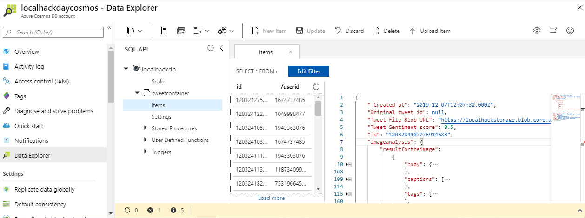

# LocalHackTweetAnalysis

This is a simple web Application used to analyse the tweets done by the people during the LocalHackDay 2019 by MLH.

## Components Used

- Azure Web App
- Azure Cognitive API (Computer Vision, Text Analytics)
- Azure Logic App
- Azure Cosmos DB
- Azure Search

